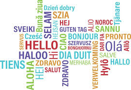
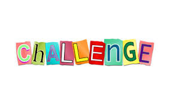

Learning how to program is like learning a foreign language, it is not easy and it takes time. Now, I am learning another language, Javascript. Compare to the other programming languages that I know, I think Javascript is simpler. It is not as strict as other languages so you can code faster. A lot of people would say that Javascript is a bad programming language because it has quite a few warts but all programming languages has their ups and downs.

Doing the practice WODs really helps with developing the skills. It gives you short problems to work on for certain amount of time. I find this enjoyable and at the same time stressful because we are being timed. So sometimes I get nervous because of the time which ended up not being able to concentrate on what I have to do. There will be more practice WODs for the rest of the semester and I think that will help me get comfortable with the timer.

