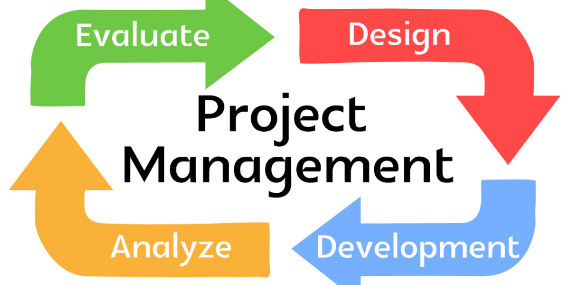

Now that the semester (Fall 2020) is almost over, I gained a lot more information on software engineering. I learned and worked with JavaScript, HTML, Meteor, and many more during the semester. I was able to apply what I learned in my Software Engineering class through developing a web application. 

Issue Driven Project Management
--

For the final project of my Software Engineering class, I had to work in a group and develop a web application. We were given a topic and had to create a web application for about four weeks. To keep us organized and to make sure everyone is working and contributing to the project, we followed the [Issue Driven Project Management (IDPM) Guidelines](http://courses.ics.hawaii.edu/ics314f20/morea/project-management/reading-guidelines-idpm.html). The guideline helped my group a lot because it suggested that we create a project board which will show what issue each member has and working on. It also suggested that we meet at least twice a week and divide the work into 72 hours. Without the guideline I think my group will have a hard time being organize and keeping track of what needs to be done.

Open Source Software Development
--
