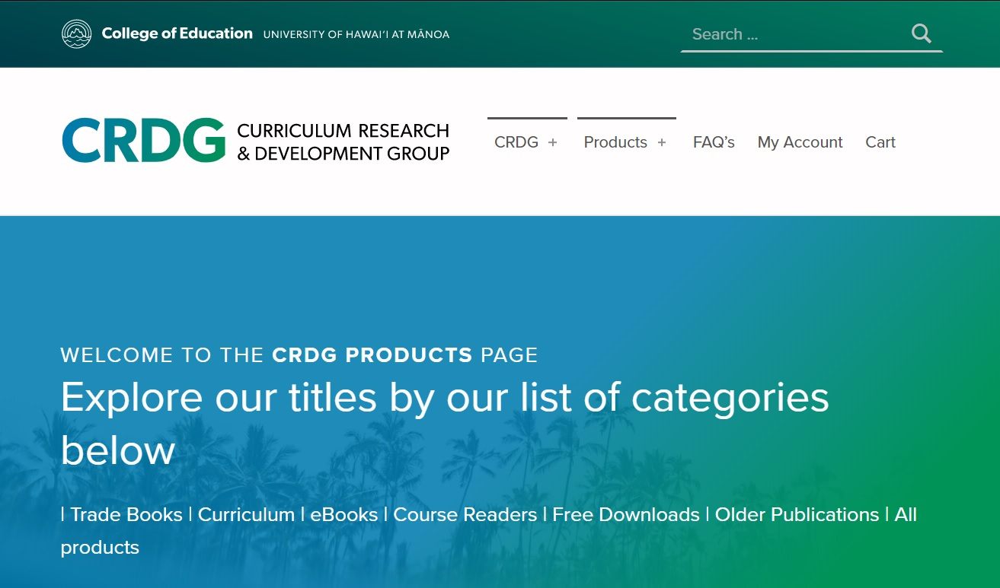

Last year, the company that I was working for changed the website that they are using. Because it is a new website, we need to transfer all of the information from the old website to the new one. My advisor assigned me to update/input all of the information for each of the products that we have. The information needed are the product name, author, year published, product type (PDF, ePub, soft cover, hard cover), dimensions, weight, and price. I also have to figure out the shipping cost for each product so I have to check with USPS and FedEx. 

