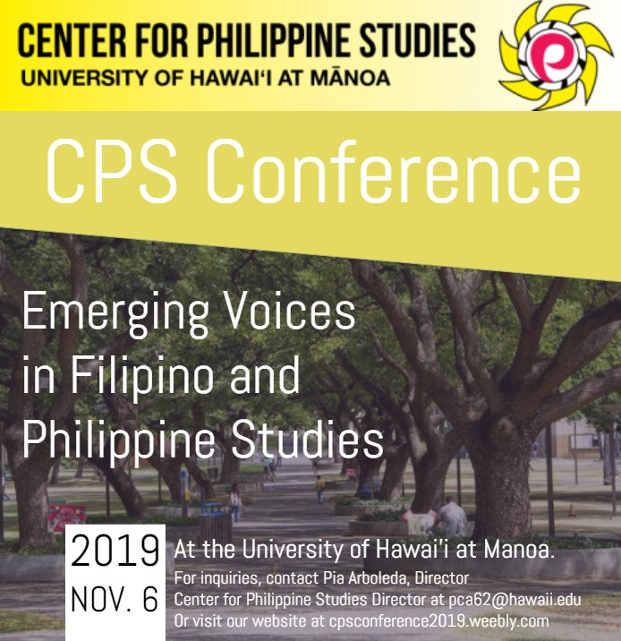

The Center for Philippine Studies at University of Hawaii at Manoa held a conference on November 2019. I was working for the department that organized the conference as a student assistant. The department asked their student assistants to help out for the event. Either they can help with the preparation and/or during the event.

Days before the event, I was helping with testing the equipments. We needed to make sure that everything is ready to be used for the day of the conference. First, we tested the timer and it's remote. Second, we tested if the microphones that we have are still working properly or if we need a new one. Third, we tested the speaker. It was a new speaker so we tried how our phones and laptops can connect to the speaker using Bluetooth. Lastly, we tested the walkie talkies. None of use used one before so we were figuring out how can we communicate using it.

On the actual day of the conference, I was assigned to be one of the technical support for the event. I set up the speaker that was provided by the Center for Philippine Studies and connected the laptop that will be used to play the background music. During the event while the speakers are presenting, I controlled the timer and the music that will give signal that they only have 10 seconds left for their presentation. I stayed for the entire day just in case there's any technical difficulties. 
