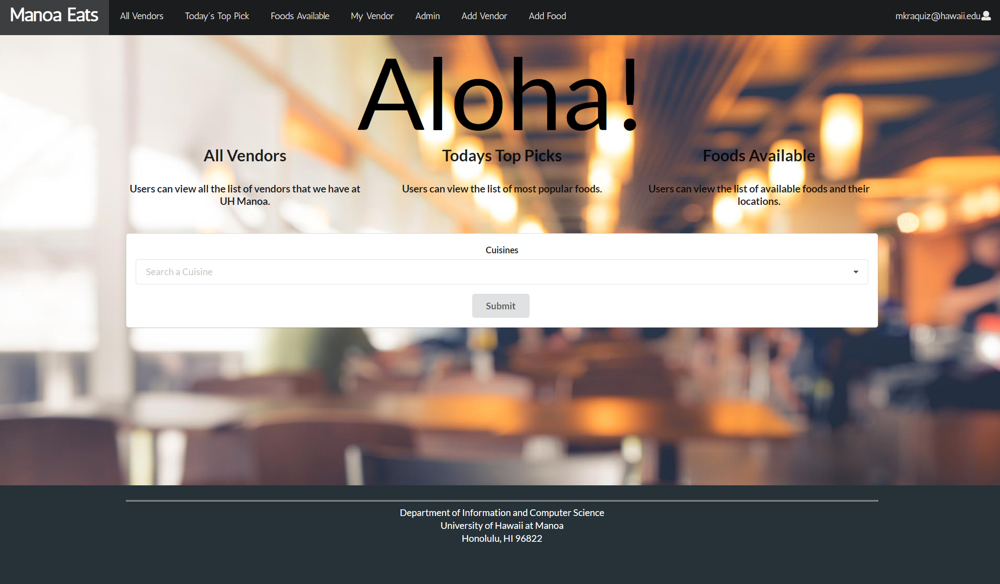
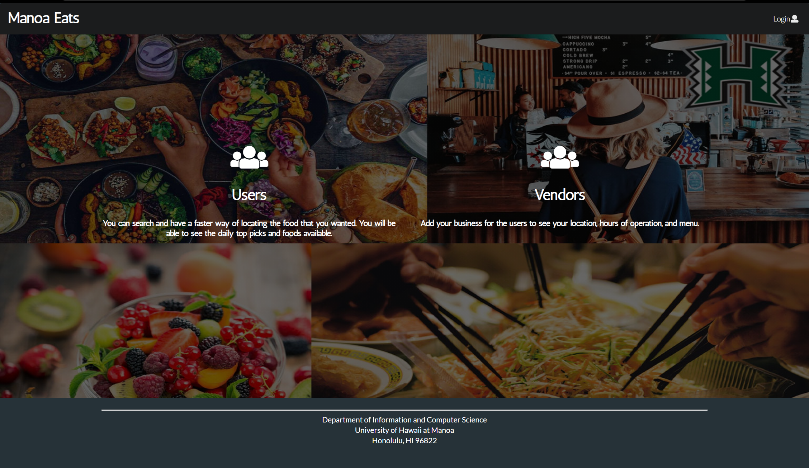
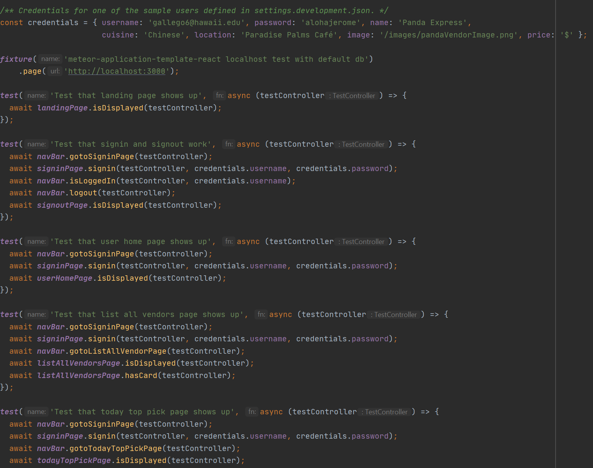

What is ManoaEats?
--

ManoaEats is a web application that helps students and faculty of UH Manoa to find what kind of vendors and foods available on campus. They will have the ability to search the vendors, look at specific menu items and style of food, and what food item is currently available. In the development of this application, I worked with Jerome Gallego, Yeji Han, and Christine Guira.

My Contributions
--

One feature of our web application that I was able to make was the Landing page (the above image) where it will be the first page that the users will see when they visit our web application. It also gives information to the general users (students and faculties) on what they can do with the web application and it gives instructions to the vendors that wants to add their business.

Another feature that I worked on, but unfortunately was not able to make it to the final product, was the User Profile page where the registered users can edit their profile information like their first and last name, password, and email. 

I also worked on the testcafe where it will test the pages that our wep application has. It will check if the pages are showing up and if the functions are working.

What I learned
--

Doing this project requires a lot of time and patience. You need to manage your time wisely and communicate with your group. Since we did this entire project completely online and my group wasn't able to meet in person because of the pandemic, it made it difficult to work on this project. When we encounter an issue on the page that we're building, it was difficult to help one another because we can only see each other's screen through screen share on Discord. Even though it was a challange to develop this application without seeing my groupmates in person, we were able to make it work. If we needed help, we always ask each other and help each other out.

Want to learn more about ManoaEats?
--

If you are interested in learning more about ManoaEats, you can check [ManoaEats home page](https://manoaeats.github.io/) where it will give you more information on how we developed the application. 

You can also check our web application at [ManoaEats](https://manoaeats.xyz/#/).
